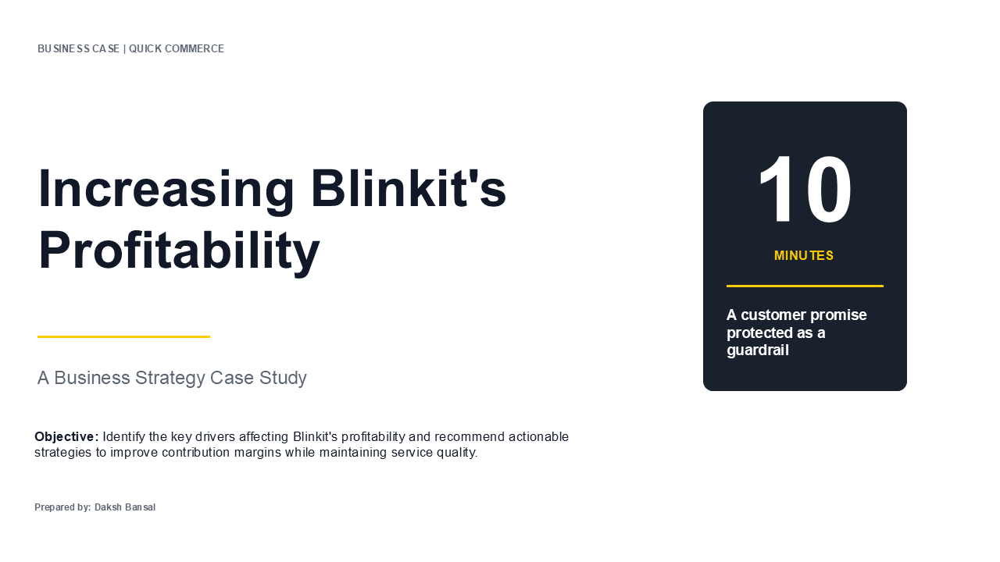
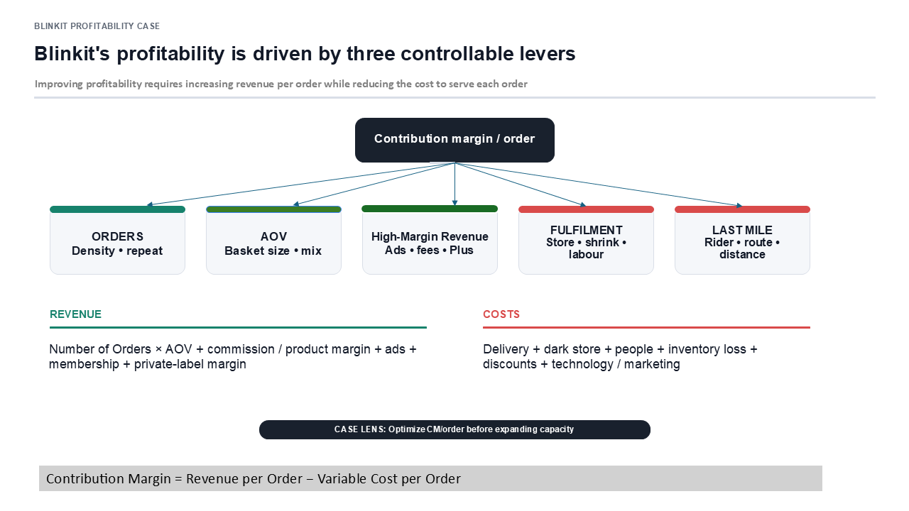
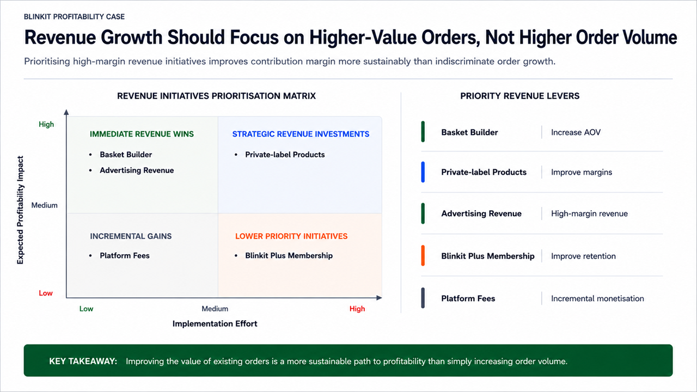
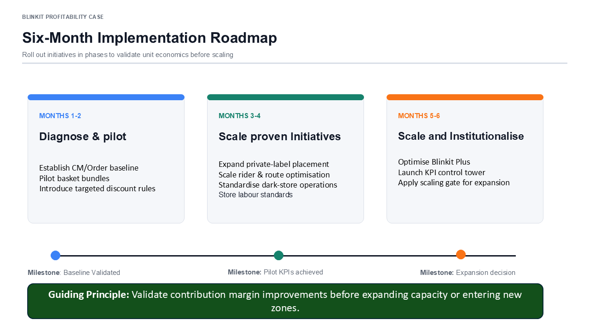

# Blinkit Profitability Consulting Case

A consulting-style business strategy case focused on identifying the key drivers of Blinkit's profitability and recommending practical initiatives to improve contribution margin while maintaining its 10-minute delivery promise.

---

## Project Overview

Blinkit has grown rapidly as one of India's leading quick-commerce platforms. While rapid expansion has increased customer reach, it has also created pressure on unit economics through higher fulfilment costs, lower order density in new zones, and increased promotional spending.

This case approaches the problem from a consulting perspective by analysing Blinkit's business model, identifying the primary profitability drivers, and proposing a phased implementation roadmap supported by measurable KPIs.

---

## Business Objective

Develop practical recommendations that improve profitability without compromising Blinkit's core customer proposition of ultra-fast delivery.

---

## Approach

The analysis follows a structured consulting approach:

- Understand Blinkit's operating model
- Build a profitability framework
- Identify root causes affecting contribution margin
- Prioritise improvement initiatives
- Define KPIs to measure success
- Recommend a phased implementation roadmap

---

## Key Recommendations

- Increase Average Order Value through basket-building initiatives
- Expand private-label products to improve gross margins
- Improve rider productivity and dark-store utilisation
- Optimise discounting through targeted promotions
- Strengthen Blinkit Plus as a long-term retention lever
- Monitor performance using a balanced KPI dashboard instead of focusing solely on GMV

---

## Presentation Preview

### Cover



---

### Profitability Framework



---

### Revenue Prioritisation



---

### Implementation Roadmap



---

## Frameworks Used

- Profitability Tree
- Unit Economics Analysis
- Root Cause (MECE)
- Impact vs Effort Prioritisation
- KPI Dashboard
- Six-Month Implementation Roadmap

---

## Repository Structure

```text
.
├── Blinkit_Profitability_Consulting_Case.pdf
├── Blinkit_Profitability_Consulting_Case.pptx
├── images
│   ├── cover.png
│   ├── profitability-tree.png
│   ├── revenue-prioritization.png
│   └── roadmap.png
├── README.md
└── LICENSE
```

---

## Skills Demonstrated

- Business Strategy
- Profitability Analysis
- Unit Economics
- Structured Problem Solving
- Executive Presentation Design
- KPI Design
- Strategic Prioritisation
- Business Communication

---

## Disclaimer

This project is an independent case study created for learning and portfolio purposes. Publicly available information has been used wherever possible. Any assumptions or illustrative models included in the presentation are clearly identified and should not be interpreted as Blinkit's actual financial figures or internal business metrics.

---

## Author

**Daksh Bansal**

If you have feedback or would like to discuss the case, feel free to connect with me on LinkedIn.
